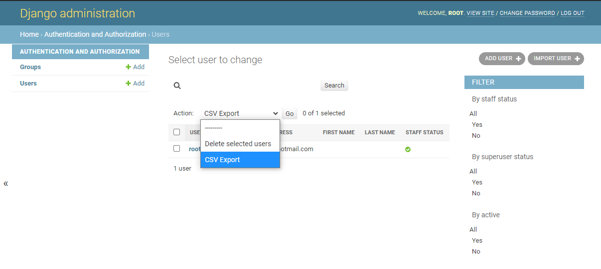

# csv-with-modelform-check
Checked-csv is a Django plusin for importing and exporting model with included admin integration.

## Features

- admin integration for export and import
- multi-encoding support
- import error check by model form
- import error reporting

## Screenshots

## Installation and configuration
- installation
  <pre>
  >pip install checked-csv
  </pre>
- configuration(settings.py)
  <pre>
  INSTALLED_APPS = (
    ...
    'checked-csv',
  )
  </pre>

## Example app
cd testsite
